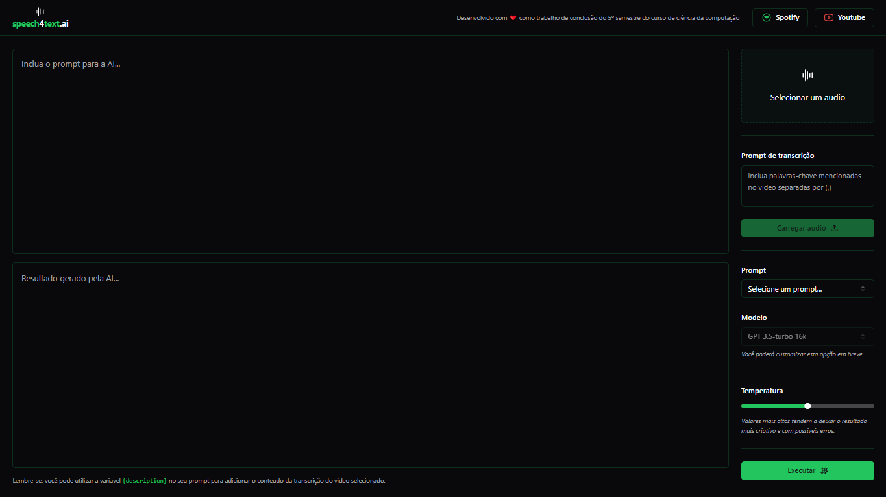

<br>
<br>
<h1 align="center">Speech4Text.AI</h1>

## Visão Geral

Este monorepo contém dois projetos principais: o backend (`speech4text-backend`) e o frontend (`speech4text-ai-front`) para a aplicação Speech4Text. A aplicação Speech4Text utiliza IA para converter fala em texto, fornecendo uma interface amigável para os usuários.

> Projeto desenvolvido para conclusão do quinto semestre do curso de ciência da computação na uninove.

## Projetos

### 1. speech4text-backend

#### Descrição
O serviço de backend é construído com Fastify, Prisma e TypeScript. Ele lida com requisições API, gerencia interações com o banco de dados e integra-se com a API OpenAI para funcionalidades impulsionadas por IA.

#### Instalação

1. Clone o repositório e navegue até o diretório do backend:
   ```bash
   git clone https://github.com/ias4g/projeto-desenvolvimento-aplicacoes-multiplataforma-5-semestre-2024.git

   cd projeto-desenvolvimento-aplicacoes-multiplataforma-5-semestre-2024
   ```

2. Instale as dependências:
   ```bash
   pnpm install
   ```

#### Scripts

- **Desenvolvimento**: Inicie o servidor de desenvolvimento com recarregamento automático.
  ```bash
  pnpm run dev
  ```

- **Seed do Banco de Dados**: Execute o script de seed do Prisma para popular o banco de dados com dados iniciais.
  ```bash
  npx prisma db seed
  ```

---

### 2. speech4text-ai-front

#### Descrição
O frontend é construído com React, Vite e TailwindCSS. Ele fornece uma interface moderna e responsiva para os usuários interagirem com a aplicação Speech4Text.

#### Instalação

1. Clone o repositório e navegue até o diretório do frontend:
   ```bash
   git clone https://github.com/ias4g/projeto-desenvolvimento-aplicacoes-multiplataforma-5-semestre-2024.git

   cd projeto-desenvolvimento-aplicacoes-multiplataforma-5-semestre-2024
   ```

2. Instale as dependências:
   ```bash
   pnpm install
   ```

#### Scripts

- **Desenvolvimento**: Inicie o servidor de desenvolvimento do Vite.
  ```bash
  pnpm run dev
  ```

## Contribuindo

Contribuições para melhorar a aplicação Speech4Text são bem-vindas. Para contribuir, siga estes passos:

1. Faça um fork do repositório.
2. Crie uma nova branch (`git checkout -b feature/sua-feature`).
3. Faça suas alterações.
4. Commit suas alterações (`git commit -am 'Adicionar nova feature'`).
5. Faça push para a branch (`git push origin feature/sua-feature`).
6. Crie um novo Pull Request.

## Licença

Este projeto está licenciado sob a [MIT LICENSE](LICENSE).

## Autores

Este projeto é mantido pela equipe do Speech4Text. Contribuições da comunidade são bem-vindas e encorajadas.